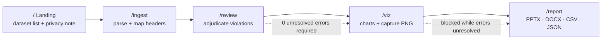
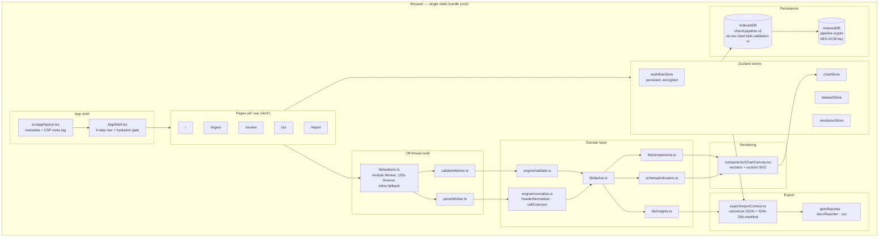
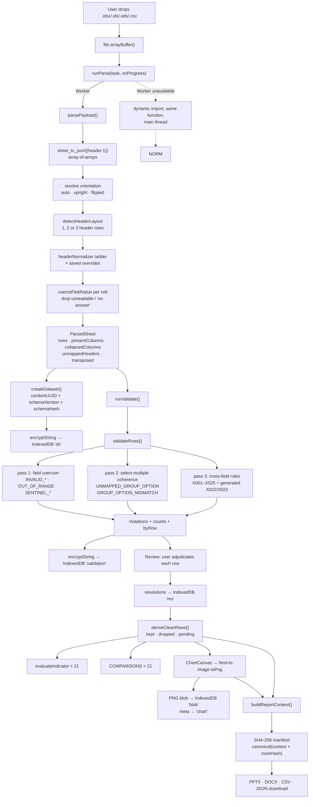
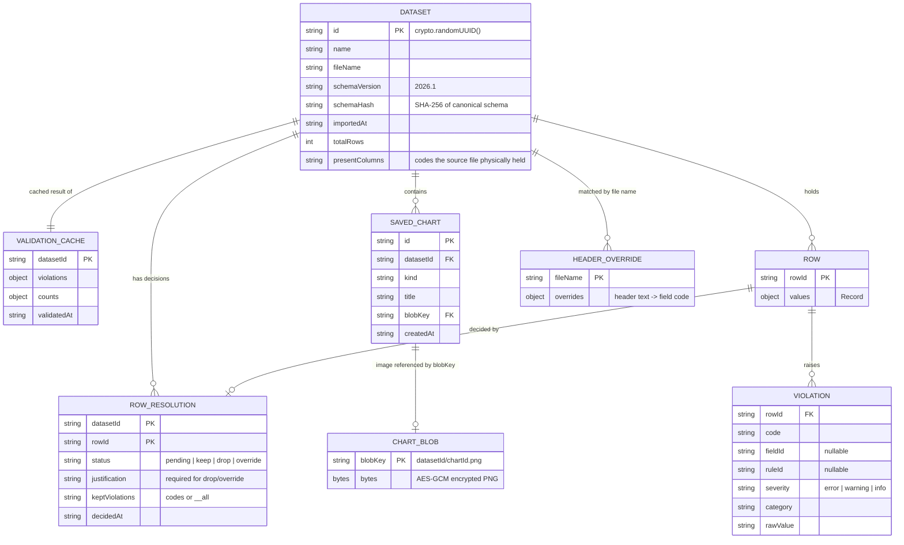
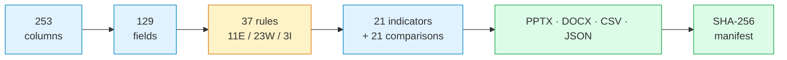

# PROJECT_CONTEXT.md — VHSND & PMSMA Pipeline

**Purpose:** single-file source of truth for this repository. Every claim below was read from source,
from the test suite, or measured by running the repo's own code. Anything that could not be verified is
marked **TBD / Not found in codebase** rather than guessed.

**Source of truth:** working tree at commit `7ba9745` (branch `main`), verified 2026-10-03.

**Companion documents**

| Document | Role |
|---|---|
| `README.md` | Product overview (plain language) + technical deep dive |
| `docs/PIPELINE.md` | Line-cited codemap: stage-by-stage pipeline with `file:line` references |
| `docs/DATA-MODEL.md` | Column registry, field DSL, validation rules, indicators, comparisons, extension recipes |
| `docs/DEVELOPMENT.md` | Contributor setup, quality gates, scripts, troubleshooting |

**Status legend used throughout:** **Implemented** · **Partially implemented** · **Planned / Not found in codebase**

---

## Table of contents

1. [Project Overview](#1-project-overview) · 2. [Features and User Flows](#2-features-and-user-flows) ·
3. [Tech Stack](#3-tech-stack) · 4. [Architecture](#4-architecture) · 5. [Folder & File Structure](#5-folder--file-structure) ·
6. [Database Design](#6-database-design) · 7. [API / Backend](#7-api--backend) · 8. [Frontend](#8-frontend) ·
9. [Business Logic](#9-business-logic) · 10. [Third-Party Integrations](#10-third-party-integrations) ·
11. [Configuration & Environment](#11-configuration--environment) · 12. [Setup & Installation](#12-setup--installation) ·
13. [Deployment](#13-deployment) · 14. [Security & Performance](#14-security--performance) ·
15. [Testing](#15-testing) · 16. [Known Issues, Limitations & Technical Debt](#16-known-issues-limitations--technical-debt) ·
17. [Future Enhancements](#17-future-enhancements) · 18. [Development History](#18-development-history) ·
19. [Screenshots & Diagrams Needed](#19-screenshots--diagrams-needed) · 20. [Glossary & Quick Facts](#20-glossary--quick-facts) ·
[Coverage Report](#coverage-report)

---

## 1. Project Overview

### 1.1 What it is

An **offline-first, browser-only data-cleaning and reporting pipeline** for VHSND (Village Health &
Sanitation Day) household survey sessions. A health official drops an ODK/Excel export into the browser;
the app normalises it against the survey schema, flags contradictions, lets a human adjudicate each
flagged row with a written justification, charts the result, and exports a signed-off report.

**Nothing is uploaded.** There is no server component: the build is a pure static export
(`next.config.ts:4`), every page is a client component, all survey data lives in the browser's IndexedDB
encrypted at rest, and a Content-Security-Policy plus a build gate enforce that no request ever leaves
the origin (`src/app/layout.tsx:10-25`, `scripts/check-offline.mjs:18-34`).

### 1.2 Who it is for

| Audience | Need |
|---|---|
| District / block health officials | Clean an ODK export and produce a defensible report without uploading health data |
| Programme reviewers & auditors | Reconstruct *why* each row was kept, dropped or overridden, from the audit log and the SHA-256 manifest |
| Data engineers | Extend the schema, rules, indicators and comparisons through a typed DSL rather than ad-hoc code |

### 1.3 Scope reality check

Despite the product name, **only the `vhsnd` dataset kind exists**.
`SUPPORTED_DATASET_KINDS = ["vhsnd"]` (`src/schema/index.ts:5`). `pmsma` is declared as a *type*
(`src/contracts/dataset.ts:13`) but has no schema, no column registry and no rules — **Partially
implemented**. See §16.

### 1.4 Scale (measured)

| Quantity | Value |
|---|---|
| Column registry | 253 columns |
| Schema fields | 129 (of which 14 are select-multiple groups) |
| Cross-field rules | 37 (11 error, 23 warning, 3 info) across 24 distinct codes |
| Indicators | 21 |
| Comparisons | 21 across 6 categories, spanning 14 chart kinds |
| Chart kinds rendered | 18 |
| Source files | 50 in `src/` |
| Tests | 19 files / 212 tests, all passing |
| Static routes | 6 |
| Databases | 2 IndexedDB databases (6 object stores + 1 key store) |
| Backend services | **0** |

---

## 2. Features and User Flows

### 2.1 The four-stage flow (the happy path)

`/` → `/ingest` → `/review` → `/viz` → `/report`. Navigation is defined in
`src/components/AppShell.tsx:8-13`.



### 2.2 Feature inventory

| # | Feature | Route / entry point | Status | Notes |
|---|---|---|---|---|
| F1 | Drop-zone file import (`.xlsx .xls .ods .csv`) | `src/app/ingest/page.tsx:142-169` | **Implemented** | Single file, extension-guarded (`:146-151`); raw `ArrayBuffer` kept so the same file can be re-read without re-picking |
| F2 | Header → field mapping (resolution ladder) | `src/schema/engine/headerNormalizer.ts:419-437` | **Implemented** | Exact code/label → embedded code token → numbering-stripped label → fuzzy Dice match → near-word match; ambiguous ties rejected rather than guessed |
| F3 | Unmatched-title mapping card | `src/app/ingest/page.tsx:324-379` | **Implemented** | One `<select>` per unmapped title over all 253 columns; choice saved against the file name and replayed on the next read |
| F4 | Transposed ("sideways") export detection | `src/schema/engine/normalize.ts:322-344` | **Implemented** | Requires ≥30 rows, ≥2:1 row:column ratio, and two independent signals; manual override available |
| F5 | Multi-row header detection (incl. 3-row ODK code row) | `src/schema/engine/normalize.ts:355-408` | **Implemented** | Scans rows 1–3 for the form's own code row (≥90% known codes) |
| F6 | Contradiction / validation engine | `src/schema/engine/validate.ts:41-95` | **Implemented** | Field coercion, select-multiple coherence, cross-field rules; a throwing rule degrades to `RULE_EVALUATION_ERROR` instead of crashing |
| F7 | Row-level adjudication (keep / drop / override) | `src/components/RowDrawer.tsx` | **Implemented** | Drop and override require a written justification (`:62`); override values are re-coerced through the schema on save (`:113-116`) |
| F8 | Audit log of every decision | `src/app/review/page.tsx:304-332`, `src/export/reportContext.ts:65-74` | **Implemented** | Sorted by `decidedAt`; embedded in every export |
| F9 | Dataset insights (present / present-but-empty / missing / sparse) | `src/lib/insights.ts:37-89` | **Implemented** | Sparse = fill rate <50% (`:87`) |
| F10 | Cleaning insights + viz insights | `src/lib/insights.ts:103-124,139-168` | **Implemented** | |
| F11 | Indicator charts (21 indicators) | `src/schema/indicators.ts:42-94` | **Implemented** | Five data types: time-series, categorical, geospatial, numeric, numeric-distribution |
| F12 | Comparison charts (21 comparisons) | `src/lib/comparisons.ts:320-1090` | **Implemented** | Each returns `{kind, series, extra, insight, columnsUsed, columnsMissing}` |
| F13 | Partial-comparison gate ("Cannot show this in full") | `src/app/viz/page.tsx:335-366` | **Implemented** | A comparison whose columns the file lacks is **not drawn** until the user opts in, so a partial file cannot be read as a smaller result |
| F14 | Chart PNG capture to report | `src/app/viz/page.tsx:126-158` | **Implemented** | `html-to-image` `toPng`, `pixelRatio: 2`, white background |
| F15 | PPTX export | `src/export/pptxReporter.ts:20-112` | **Implemented** | Title, cleaning summary, indicators, one slide per saved chart, audit appendix |
| F16 | DOCX export | `src/export/docxReporter.ts:13-51` | **Implemented** | `docx-templates` with `{{chartImage blobKey}}` helper; requires an embedded template |
| F17 | Cleaned CSV export | `src/export/csv.ts:17-30` | **Implemented** | Header is `label (code)`; booleans as `1`/`0`; CRLF line endings |
| F18 | Audit JSON export | `src/app/report/page.tsx:87-91` | **Implemented** | The full `ReportContext` including the manifest |
| F19 | SHA-256 manifest binding | `src/export/reportContext.ts:111-118` | **Implemented** | `manifest` = SHA-256 over canonical JSON of the context + a hash of the cleaned rows |
| F20 | Encryption at rest | `src/lib/crypto.ts:18-82` | **Implemented** | AES-256-GCM, fresh 12-byte IV per operation |
| F21 | Erase all local data | `src/app/report/page.tsx:129-134` → `src/lib/storage/idb.ts:260-273` | **Implemented** | Deletes every database whose name starts with `vhsnd-pipeline` or `pipeline-crypto` |
| F22 | Mandatory-unresolved-error gate before viz/report | `src/app/review/page.tsx:146-153`, `src/app/report/page.tsx:180-191` | **Implemented** | Hard block, not a warning |
| F23 | Multiple saved datasets + switcher | `src/stores/datasetStore.ts`, `src/components/DatasetPicker.tsx` | **Implemented** | |
| F24 | Re-import of the same file | `src/app/ingest/page.tsx:278-302` | **Partially implemented** | A new import always mints a new dataset id, so **decisions do not carry over**; a re-read on the ingest screen deletes the dataset that screen created, but a re-import in a later visit strands the old copy |
| F25 | `pmsma` dataset kind | `src/contracts/dataset.ts:13` | **Planned / Not found in codebase** | Type only. No schema, no columns file, no rules, no UI entry |
| F26 | Mandatory-field enforcement (`MISSING_REQUIRED`) | `src/schema/versions/v2026-1.ts:178` (`required: true` on `B8`) | **Partially implemented** | The flag is declared but **no code path emits the violation**; only tests reference it |
| F27 | Service worker / true offline PWA | — | **Not found in codebase** | No SW registration anywhere in `src/` |
| F28 | Authentication / multi-user | — | **Not found in codebase** | Single-user local app by design |
| F29 | CI/CD pipeline | — | **Not found in codebase** | No `.github/`, no other CI config; `npm run ci` exists for local use |
| F30 | Code coverage reporting | — | **Not found in codebase** | No coverage config or threshold in `vitest.config.ts` |

### 2.3 User flows in detail

**Flow A — first-time import of an ODK export**

1. Land on `/`, see the privacy statement and any locally saved datasets (`src/app/page.tsx:101-145`).
2. `/ingest`: drop the workbook. Progress moves through `reading → parsing → validating → done`
   (`src/app/ingest/page.tsx:60-137`).
3. Parser reads the sheet to an **array-of-arrays** so repeated "Others (Specify)" labels never collapse
   into one key (`src/workers/parseWorker.ts:43-48`); orientation is resolved; headers are mapped.
4. A new `crypto.randomUUID()` dataset id is minted, `schemaVersion` + `schemaHash` attached, snapshot
   encrypted into IndexedDB (`src/stores/datasetStore.ts:40-58`).
5. Validation runs and is cached; the screen reports columns recognised vs missing critical
   (`src/app/ingest/page.tsx:100-104`).
6. Up to three post-import notices may appear: **orientation**, **collapsed columns** (with wording that
   distinguishes the file's fault from ours, `src/lib/ingestCopy.ts:11-24`), and **unmatched titles**.

**Flow B — review and adjudicate**

- Violations are deduplicated by `${rowId}|${code}|${fieldId ?? ruleId}|${rawValue}`
  (`src/contracts/violation.ts:42`), filtered by severity, and listed.
- The drawer records keep / drop / override. Keep may acknowledge specific error codes or `__all`.
- "Still pending" is defined precisely: an `error` violation whose row is undecided, or kept without
  acknowledging that code (`src/lib/derive.ts:74-90`).

**Flow C — visualise**

- Choose indicator mode or comparison mode (`src/app/viz/page.tsx:39`).
- Comparisons whose inputs the file lacks are withheld behind an explicit opt-in; once opted in, the
  chart carries a "Partial view — not in this file: …" line and **Add to report** unlocks.
- "Add to report" rasterises the chart card to PNG and stores both metadata and encrypted blob.

**Flow D — export**

- Export is blocked while any unresolved error exists or the cleaned set is empty.
- Four formats are produced in-browser and downloaded via object URL.

---

## 3. Tech Stack

### 3.1 Runtime

| Layer | Choice | Version | Source |
|---|---|---|---|
| Framework | Next.js (App Router, Turbopack) | 16.3.6 | `package.json` |
| UI library | React / React DOM | 19.2.8 | `package.json` |
| Language | TypeScript (`strict: true`, `noEmit`) | ^5 | `tsconfig.json:11` |
| Build output | Static export (`output: "export"`, `distDir: "out"`, `trailingSlash`) | — | `next.config.ts:4-6` |
| React Compiler | enabled | — | `next.config.ts:10` |
| State | Zustand (with encrypted persistence adapter) | ^5.0.15 | `src/stores/**` |
| Charts | recharts + 4 hand-built SVG/DOM renderers | ^3.10.1 | `src/components/ChartCanvas.tsx:5-32` |
| Spreadsheet parsing | SheetJS `xlsx`, **vendored tarball** | 0.20.3 | `package.json` → `vendor/xlsx-0.20.3.tgz`, used at `src/workers/parseWorker.ts:31` |
| PPTX generation | pptxgenjs | ^4.0.1 | `src/export/pptxReporter.ts:1` |
| DOCX generation | docx-templates | ^4.15.0 | `src/export/docxReporter.ts:1` |
| Chart rasterisation | html-to-image | ^1.11.13 | `src/app/viz/page.tsx` |
| File drop | react-dropzone | ^20.1.2 | `src/app/ingest/page.tsx` |
| Key/value store | idb-keyval | ^6.3.0 | `src/lib/crypto.ts:3` |
| Crypto | Web Crypto API (AES-GCM-256) | browser built-in | `src/lib/crypto.ts` |
| Test runner | Vitest (`environment: "node"`) | ^5.0.1 | `vitest.config.ts:6` |
| Lint | ESLint flat config + `eslint-config-next` | ^9 | `eslint.config.mjs` |

### 3.2 Runtime environment requirements

| Requirement | Why |
|---|---|
| A modern browser with Web Workers, Web Crypto (`crypto.subtle`), IndexedDB | Parsing, validation, encryption, persistence |
| `crypto.subtle` (secure context) | SHA-256 manifest and AES-GCM — **not available over plain `http://` on a non-localhost origin** |
| ES module Workers | `src/lib/workers.ts` constructs module workers; there is an inline fallback |
| Sufficient IndexedDB quota | Full survey snapshots are held locally |

### 3.3 Declared but unused

`zod@^4.6.5` is a declared dependency (`package.json`) but is **never imported** anywhere in `src/`,
`tests/` or `scripts/`. The schema system uses its own DSL (`src/schema/dsl.ts`). It is also a transitive
dependency of `docx-templates`. See §16.

---

## 4. Architecture

### 4.1 Style

A **layered, client-only static application**. There is no server tier, no API tier, and no shared
runtime between "frontend" and "backend" — every stage from file read to file write executes in the
browser. The layering is logical, enforced by directory structure and import direction:

```
routes (src/app)  →  state (src/stores)  →  domain (src/schema, src/lib)  →  contracts (src/contracts)
                                              ↓
                                    persistence (src/lib/storage, src/lib/crypto)
```

The practical consequence: **`src/contracts/` is the shared vocabulary** that both the domain layer and
the UI layer speak, which is what keeps a client-only app from collapsing into tangled components.

### 4.2 System diagram



### 4.3 Pipeline data flow



### 4.4 Worker strategy

`src/lib/workers.ts` is the single entry point for heavy work.

| Concern | Behaviour |
|---|---|
| Worker creation | `new Worker(new URL("../workers/parseWorker.ts", import.meta.url), { type: "module" })` (`workers.ts:36-58`, `:128-134`) |
| Capability probe | `canUseWorker` constructs and immediately terminates a worker to test support |
| Timeout | 120 000 ms for parse (`:63`) and validate (`:139`) |
| Browser fallback | Dynamic `import()` of the same module, executed inline on the main thread (`:90-116`, `:163-184`) |
| Non-browser | Rejects with `WorkerUnavailableError` (`:26-29`, `:92-95`, `:164-167`) |
| Shared code path | Both the worker and the fallback call the *same* pure `parsePayload` / `validatePayload`, so behaviour cannot drift between the two |

**Consequence:** in Node (i.e. in the test suite) workers are unavailable, which is precisely why the
workers' payload functions are written as pure, directly testable functions.

---

## 5. Folder & File Structure

```
vhsnd-pipeline/
├── src/
│   ├── app/                          App Router — every page is a client component
│   │   ├── layout.tsx                root layout, metadata, CSP meta tag
│   │   ├── globals.css               design tokens (--info, --warning, --warning-soft)
│   │   ├── favicon.ico
│   │   ├── page.tsx                  landing: stage cards, local dataset table, privacy note
│   │   ├── ingest/page.tsx           drop zone, orientation, header mapping, insights
│   │   ├── review/page.tsx           violation table, severity filters, RowDrawer, audit log
│   │   ├── viz/page.tsx              indicator/comparison charts, partial gate, PNG capture
│   │   └── report/page.tsx           PPTX/DOCX/CSV/JSON exports, manifest stats, data wipe
│   ├── components/                   shared UI (7 files)
│   │   ├── AppShell.tsx              nav + hydration gate
│   │   ├── ChartCanvas.tsx           all chart kinds, one shared tooltip, custom SVG renderers
│   │   ├── ColorPicker.tsx           palette swatches, multi-select
│   │   ├── DatasetPicker.tsx         local dataset list + switcher
│   │   ├── InsightPanel.tsx          collapsible card wrapping SummaryCards
│   │   ├── RowDrawer.tsx             per-row decision form
│   │   └── SummaryCard.tsx           metric tile (value + tone)
│   ├── contracts/                    shared types + pure helpers  ← the internal "API"
│   │   ├── chart.ts                  ChartKind, ChartConfig, SavedChart, ChartSuggestion
│   │   ├── dataset.ts                CellValue, NormalizedRow, DatasetSnapshot, DatasetSummary, SourceMeta
│   │   ├── indicator.ts              IndicatorDef, Aggregation, DataType, ComputedStats
│   │   ├── resolution.ts             RowResolution, ResolutionStatus, CleanRow, applyResolution
│   │   └── violation.ts              Violation, Severity, ViolationCategory, violationKey, keyedViolations
│   ├── lib/
│   │   ├── comparisons.ts            21 comparisons across 6 categories (largest source file)
│   │   ├── crypto.ts                 AES-GCM encrypt/decrypt + key management
│   │   ├── derive.ts                 deriveCleanRows, unresolvedErrors
│   │   ├── ingestCopy.ts             user-facing wording for collapsed columns
│   │   ├── insights.ts               dataset / cleaning / viz insights
│   │   ├── workerScope.ts            typed globalThis shim for worker modules
│   │   ├── workers.ts                runParse / runValidate + fallback
│   │   └── storage/idb.ts            versioned IndexedDB wrapper, all read/write helpers, wipe
│   ├── schema/
│   │   ├── columns-vhsnd.ts          GENERATED from data/vhsnd-columns.csv — do not hand-edit
│   │   ├── dsl.ts                    field/rule DSL + canonical projection + stable stringify
│   │   ├── index.ts                  SCHEMA_VERSION, SUPPORTED_DATASET_KINDS, schema hash
│   │   ├── indicators.ts             21 indicator definitions, evaluation, chart suggestions
│   │   ├── engine/
│   │   │   ├── accessors.ts          value access helpers for predicates
│   │   │   ├── cellCoercers.ts       boolean/int/number/date/time/serial/sentinel coercion
│   │   │   ├── groupChildren.ts      select-multiple child resolution (nested roots explicit)
│   │   │   ├── headerNormalizer.ts   the header resolution ladder + fuzzy matching
│   │   │   ├── normalize.ts          AOA → ParsedSheet, orientation, header layout
│   │   │   └── validate.ts           validateRows — the three-pass contradiction engine
│   │   └── versions/v2026-1.ts       the 2026.1 schema: 129 fields + 37 cross-field rules
│   ├── stores/                       Zustand
│   │   ├── workflowStore.ts          activeDatasetId, hydration flag (encrypted persistence)
│   │   ├── datasetStore.ts           active snapshot + validation cache
│   │   ├── resolutionStore.ts        per-row decisions
│   │   └── chartStore.ts             saved charts + PNG blob references
│   ├── export/
│   │   ├── csv.ts                    cleaned CSV writer + downloadBlob
│   │   ├── docxReporter.ts           docx-templates renderer + chart image helper
│   │   ├── pptxReporter.ts           pptxgenjs deck builder
│   │   ├── reportContext.ts          deterministic context + SHA-256 manifest
│   │   └── templates.generated.ts    GENERATED — embedded DOCX template bytes
│   └── workers/
│       ├── parseWorker.ts            parsePayload (pure) + worker scope wiring
│       └── validateWorker.ts         validatePayload (pure) + worker scope wiring
├── tests/                            19 files / 212 tests (see §15)
│   ├── engine/                       coercers, validate
│   └── schema/                       headerNormalizer, columns, rules
├── scripts/                          9 Node maintenance scripts (see §12)
├── data/vhsnd-columns.csv            253-row `label,code` registry source of truth
├── sample-data/                      committed fixtures (xlsx + csv)
├── templates/default/                DOCX letter template
├── vendor/xlsx-0.20.3.tgz            vendored SheetJS build
├── out/                              static export output (gitignored)
├── docs/                             PIPELINE · DATA-MODEL · DEVELOPMENT
├── next.config.ts  tsconfig.json  vitest.config.ts  eslint.config.mjs  package.json
├── AGENTS.md                         nextjs-agent-rules block (re-added automatically by `next dev`)
├── CLAUDE.md                         just `@AGENTS.md`
└── PROJECT_CONTEXT.md                this file
```

**Generated files — never hand-edit:**

| File | Regenerate with |
|---|---|
| `src/schema/columns-vhsnd.ts` | `node scripts/gen-columns.mjs` (edit `data/vhsnd-columns.csv`) |
| `src/export/templates.generated.ts` | `npm run embed:templates` |
| `sample-data/vhsnd-sample.xlsx` | `npm run make:sample` |
| `sample-data/DATA_EX_SHAPE.csv` | `node scripts/make-shape-sample.mjs` |

---

## 6. Database Design

**There is no SQL or server database — Not found in codebase.** Persistence is browser IndexedDB with
application-layer encryption. Two databases exist.

### 6.1 `vhsnd-pipeline` (version 2)

Declared in `src/lib/storage/idb.ts:23-26`; stores are created in `onupgradeneeded` (`:30-45`), which
lets a stale database self-heal on open.

| Store | Contents | Key strategy | Encrypted |
|---|---|---|---|
| `ds` | `DatasetSnapshot` — rows, presentColumns, schemaVersion, schemaHash, source meta | `snapshot.id` (`crypto.randomUUID()`) | Yes |
| `res` | `Record<rowId, RowResolution>` — per-dataset decisions | `datasetId` | Yes |
| `chart` | `StoredChartMeta` — chart config, title, blobKey | `chart.id` | Yes |
| `blob` | Captured chart PNG bytes | `` `${datasetId}/${chartId}.png` `` | Yes (byte-wise) |
| `validation` | `ValidationCache` — violations, counts, byRow | `datasetId` | Yes |
| `ui` | Header overrides (`hdr:<fileName>`) + Zustand workflow persistence | free-form string | Yes |

### 6.2 `pipeline-crypto`

A separate `idb-keyval` store (`src/lib/crypto.ts:3`) holding one raw 256-bit AES-GCM key under
`app-key-v1`. Keeping it in a **separate database** means `eraseAllLocalData()` deletes both, and means
the key is never co-located with the ciphertext in the same object store.

### 6.3 Encryption scheme

| Property | Value | Cite |
|---|---|---|
| Algorithm | AES-GCM, 256-bit | `src/lib/crypto.ts:18`, `:74` |
| IV | 12 random bytes, fresh per operation | `:20`, `:43`, `:53` |
| String ciphertext format | `v1.<base64 IV>.<base64 ciphertext>` | `:16-27` |
| Byte ciphertext format | `[IV(12) ‖ ciphertext]` | `:41-49` |
| Key caching | In-memory after first `getAppKey()` | `:59-82` |
| Key recovery | **None** | see §14 |
| Wipe | Deletes all `vhsnd-pipeline*` and `pipeline-crypto*` databases | `idb.ts:260-273` |

### 6.4 Conceptual ER diagram

IndexedDB has no foreign keys, so the relationships below are **logical, enforced in application
code** (by `datasetId` carried on every child record). Rendered as an ER diagram because that is how the
data actually relates.



### 6.5 Data retention

Nothing leaves the origin, and nothing is deleted except by explicit user action or by re-import logic
on the ingest screen (`src/app/ingest/page.tsx:130-132`). There is **no TTL, no quota management and no
backup** — a user who erases browser storage loses their datasets permanently.

---

## 7. API / Backend

### 7.1 Backend

**Not found in codebase.** Verified absences:

| Thing | Status | How verified |
|---|---|---|
| API route handlers (`route.ts`) | None anywhere under `src/` | glob `**/route.ts` → no matches |
| Server actions (`"use server"`) | None | no such directive in any page; all pages are `"use client"` |
| Middleware | None | no `middleware.*` file |
| Server-only modules | None | no `server*` module under `src/` |
| `fetch` / XHR to any host | None in the pipeline | no remote origins; enforced by CSP `connect-src 'self' data: blob:` |
| Environment variables read | **None** — `process.env` does not appear in `src/` | grep over source |

`next.config.ts:4` sets `output: "export"`, so a Next.js server is not part of the shipped artefact at
all. `npm start` exists but runs `next start`, which is of limited use for an export-mode project — **TBD
/ not a documented deployment path.**

### 7.2 The de-facto internal API

Because there is no network API, the contracts between layers are **TypeScript module boundaries**.
These are the app's real public surface:

| Module | Exports (the "endpoints" of the domain layer) |
|---|---|
| `src/schema/index.ts` | `SCHEMA_VERSION`, `SUPPORTED_DATASET_KINDS`, `getSchema`, `getDatasetSchema`, `canonicalSchemaJson`, `computeSchemaHash` |
| `src/schema/engine/normalize.ts` | `detectTransposed`, `transposeAoa`, `detectHeaderLayout`, `applyHeaderOverrides`, `normalizeAoa`, `buildFieldCoercer` |
| `src/schema/engine/headerNormalizer.ts` | `buildHeaderMap` → `.normalize(text)` |
| `src/schema/engine/validate.ts` | `validateRows(rows, schema, options)` → `{violations, counts, byRow}` |
| `src/lib/derive.ts` | `deriveCleanRows`, `unresolvedErrors` |
| `src/lib/workers.ts` | `runParse(task, onProgress)`, `runValidate(task, onProgress)` |
| `src/schema/indicators.ts` | `VHSND_INDICATORS`, `evaluateIndicator`, `suggestCharts` |
| `src/lib/comparisons.ts` | `COMPARISONS`, `COMPARISON_CATEGORIES`, `inFile`, `hasValues` |
| `src/export/reportContext.ts` | `buildReportContext`, `sha256Hex` |
| `src/export/pptxReporter.ts` | `generatePptxReport(ctx, chartBlobs)` → `Blob` |
| `src/export/docxReporter.ts` | `renderDocxReport(templateBytes, ctx, chartImages)` → `Blob` |
| `src/export/csv.ts` | `cleanRowsToCsv`, `downloadBlob` |
| `src/lib/storage/idb.ts` | `saveDataset`, `loadDataset`, `listDatasets`, `deleteDataset`, `saveResolutions`, `loadResolutions`, `saveChartMeta`, `loadChartMetas`, `deleteChart`, `saveChartBlob`, `loadChartBlob`, `saveValidation`, `loadValidation`, `saveHeaderOverrides`, `loadHeaderOverrides`, `eraseAllLocalData` |
| `src/lib/crypto.ts` | `encryptString`, `decryptString`, `encryptBytes`, `decryptBytes` |

### 7.3 Routes (browser pages — **not** API endpoints)

| URL | File | Generated in export |
|---|---|---|
| `/` | `src/app/page.tsx` | `out/index.html` |
| `/ingest/` | `src/app/ingest/page.tsx` | `out/ingest/index.html` |
| `/review/` | `src/app/review/page.tsx` | `out/review/index.html` |
| `/viz/` | `src/app/viz/page.tsx` | `out/viz/index.html` |
| `/report/` | `src/app/report/page.tsx` | `out/report/index.html` |
| `/_not-found/` | auto-generated by Next | `out/_not-found/index.html` — **no source file; Not found in codebase** |

`trailingSlash: true` (`next.config.ts:5`) is what makes directory-style output possible on a plain
static file server.

---

## 8. Frontend

### 8.1 Framework and rendering model

Next.js App Router, but effectively a **single-page client application**: every page carries
`"use client"`, and `src/app/layout.tsx` exists mainly for metadata and to inject the CSP. The React
Compiler is enabled (`next.config.ts:10`).

### 8.2 Layout and navigation

`AppShell` (`src/components/AppShell.tsx`) renders a `<header>` topbar with the brand, the four-step
nav (`/ingest`, `/review`, `/viz`, `/report` — `:8-13`), and an "Offline workspace" link carrying the
privacy statement as its tooltip (`:53-55`). It renders a spinner instead of content until the
encrypted workflow store has hydrated (`:19-32`), which prevents a flash of "no dataset" on reload.

### 8.3 Page responsibilities

| Page | Responsibility | Key UI affordances |
|---|---|---|
| `/` | Orientation and dataset selection | 4 stage cards; local dataset table; privacy note |
| `/ingest` | Turn a file into a dataset | Drop zone with extension guard; progress phases; success card with columns recognised / missing critical; orientation notice with manual override; duplicate-import warning; collapsed-column warning with cause-aware wording; unmatched-title mapping card with a `<select>` over all 253 columns; insights panel with top-fill table and sparse toggle |
| `/review` | Adjudicate findings | Summary cards; category badges and column coverage; unresolved-error banner; severity filter chips; violation table; sticky `RowDrawer`; audit log; "Re-run validation" |
| `/viz` | Chart and capture | Indicator vs comparison mode; indicator/comparison selects; description + recommendations + chart-type readout with "Not in this file" chip; palette picker; withheld "Cannot show this in full" card / chart card + "Partial view" line + insight box; Add to report; saved chart grid with remove |
| `/report` | Sign off and export | Blocking banner; PPTX / DOCX / CSV / audit JSON buttons; manifest stats list; About / Privacy / **Erase all local data** |

### 8.4 Charting

`ChartCanvas` (`src/components/ChartCanvas.tsx`, 582 lines) is the single rendering surface:

- **recharts** families: bar (vertical/horizontal), grouped-bar, stacked-100, line, area, pie, donut,
  funnel, radar, scatter, pareto (composed bar + cumulative line), table fallback.
- **Custom renderers** for four kinds (`CUSTOM_KINDS`, `:42`, dispatched at `:208-213`):
  `BoxPlot` (`:376-417`), `Gauges` (`:419-457`), `Waffle` (`:459-494`), `Heatmap` (`:496-554`).
- **One shared tooltip** for all ten recharts `<Tooltip />`s (`ChartTooltip`, `:68-141`): heading, one
  row per series with name and unit, and a `detail` line — resolved per series via `detail:<dataKey>`
  for multi-series charts. Scatter special-cases x/y; single-series payloads hide the redundant name.
  The custom renderers expose the same information through `<title>` elements.
- **Empty state** is a guided message rather than a blank frame (`:169-189`), telling the user to check
  that the expected columns were recognised.

The design rule enforced throughout: **a percentage is never shown bare.** `pctPoint` / `pctDetail` /
`countPoint` / `meanDetail` attach a `unit` and a `detail` string such as `"9 of 20 sites"` to every
series point (`src/lib/comparisons.ts:71-94,125-131`), so the numerator and denominator are always
visible.

### 8.5 Styling

`src/app/globals.css` defines CSS custom properties for tone: `--info`, `--warning`, `--warning-soft`
(note: there is deliberately **no `--warn` token** — `src/app/ingest/page.tsx:210-211`). Components mix
CSS classes (`.app-shell`, `.topbar`, `.data`, `.muted`, `.small`, `.empty`, `.spinner`) with large
inline `style` objects for one-off chart and layout styling.

### 8.6 Accessibility

Present: semantic `<header>/<nav>/<main>` landmarks; `aria-hidden` on decorative and loading elements;
`aria-label={title}` on every chart container (`ChartCanvas.tsx:179`, `:202`); `<label>`-visible form
controls in the drawer; real `<button>` elements for actions.

Gaps: `DatasetPicker` makes a `<tr>` clickable via `onClick` with `cursor: pointer` but supplies no
`role`, `tabIndex` or `onKeyDown` (`src/components/DatasetPicker.tsx:49-56`), so selecting a dataset by
keyboard is not possible. Explicit `<label htmlFor>` associations were not observed. See §16.

---

## 9. Business Logic

### 9.1 Schema as code

The schema is **declarative TypeScript**, not a database table.

| Layer | File | Role |
|---|---|---|
| Column registry | `data/vhsnd-columns.csv` → generated `src/schema/columns-vhsnd.ts` | 253 `label,code` pairs; the registry `VHSND_COLUMNS`, lookup `VHSND_COLUMN_MAP`, `columnLabel(code)` |
| Field DSL | `src/schema/dsl.ts` | `group`, `rule`, `yesNo`, `ordinalField`, `countWithSentinel`, `count`, `date`, `text`, plus `projectSchema` and `stableStringify` |
| Concrete version | `src/schema/versions/v2026-1.ts` | 129 fields (14 groups) + 37 cross-field rules |
| Resolution | `src/schema/index.ts` | `SCHEMA_VERSION = "2026.1"`, `SUPPORTED_DATASET_KINDS = ["vhsnd"]`, `getDatasetSchema`, `computeSchemaHash` |

`projectSchema` deliberately **excludes function bodies** so the canonical projection (and therefore the
`schemaHash` recorded on every dataset) contains only declarative identity — that is what makes the
audit hash stable across refactors of the predicate code.

### 9.2 Header resolution ladder

`buildHeaderMap().normalize` (`src/schema/engine/headerNormalizer.ts:419-437`) tries, in order:

1. Exact code or exact label (`:420-421`)
2. A known code token embedded anywhere in the header, e.g. `"8. B8"` (`CODE_TOKEN:406`, `:409-416`)
3. The label with leading numbering stripped (`:424-428`)
4. Fuzzy Dice/containment match — requires ≥3 header words, ≥2 shared words, score ≥0.6, and is
   **rejected on ties** (`FUZZY_*:30-32`, `fuzzyLabelMatch:343-371`)
5. `nearWordMatch` (`:304-341`), a deliberately narrow last resort requiring score ≥4 (`:334`)

`nearWordMatch` is narrow for a specific, hard-won reason: a Devanagari title is **one edit from a digit**
once combining marks are stripped, so stray Hindi questions all resolved to `H13` — the only label with
two standalone digits. The guards are: `fuzzyKey` keeps `\p{M}` marks (`:22-28`); Hindi function words
score nothing (`HINDI_STOPWORDS:258-283`); `isNearPair` requires both stems ≥2 characters (`:298`), the
**same alphabet** (`stemScript:285-289`), and **no digit anywhere** (`:300`) — digits must match exactly.

### 9.3 Header layout detection

`detectHeaderLayout` (`src/schema/engine/normalize.ts:355-408`):

1. **Scan rows 1–3 for the form's own code row** (`CODE_ROW_SCAN_DEPTH:288`). A row qualifies when ≥90%
   of its non-empty cells are known codes, case-insensitively (`CODE_ROW_THRESHOLD:285`). Result:
   `headerRows: 3`, `codeSource: "sheet"`. This is what three-row ODK exports (Hindi labels / English
   labels / codes) need — without it the code row itself becomes a data row and the 11 `*_SP` columns
   collapse.
2. **Repeated label row** — `isDuplicateLabelRow` (`:411-430`, called `:391`) requires ≥90% agreement
   with row 1, as titles or as resolved codes. Result: `headerRows: 2`, `dataStart: 2`,
   `codeSource: "titles"`.
3. **Fallback single label row** resolved through the normalizer. Result: `headerRows: 1`.

Saved manual matches are applied immediately after detection (`applyHeaderOverrides`, `:457-471`, called
`:491`) and mark the column `codeSource: "override"` (`:466-470`).

### 9.4 Normalisation output

`normalizeAoa` (`normalize.ts:480-599`) keys columns by code, keeps the **first** occurrence of a
repeated code, records indistinguishable duplicates in `collapsedColumns` (`:508-535`) — exact copies
are silent (`:518`) — and tags each group with a `cause`: `sheet-code` only when *every* column in the
group read its code from the file, otherwise `resolved-title` (`causeOf:528-531`). It coerces every cell
(`coerceFieldValue:88-124`), drops unreadable / "no answer" cells (`keepCell:141-144`), skips wholly empty
rows (`:576-579`), and collects `unmappedHeaders` in sheet order without repeats (`:546-555`).

### 9.5 The contradiction engine

`validateRows` (`src/schema/engine/validate.ts:41-95`) makes three passes:

**Pass 1 — field-level coercion** (`collectFieldViolations:110-295`)

| Code | Meaning | Severity |
|---|---|---|
| `INVALID_BOOLEAN` / `INVALID_INTEGER` / `INVALID_NUMBER` / `INVALID_DATE` / `INVALID_TIME` / `INVALID_ORDINAL` | value cannot be read as its declared type | error |
| `UNEXPECTED_ORDINAL` / `UNEXPECTED_VALUE` | readable but outside the declared option set | error |
| `OUT_OF_RANGE` | outside the declared range (`checkRange:429-465`) | error |
| date-window checks | date outside the plausible survey window | error |
| `SENTINEL_NO_DATA` / `SENTINEL_NOT_APPLICABLE` | a legitimate "no data" marker | **info** |
| *(blank cells)* | nothing — **a blank never raises anything** (`:119-123`) | — |

**Pass 2 — select-multiple coherence** (`checkGroupSelections:381-427`)

`parseGroupSelection` (`:320-370`) reads a parent cell written as bare tokens (`"A B 88"`), as answers
spelled out, or as label variants. Leftovers become `UNMAPPED_GROUP_OPTION`; parent/child disagreement
becomes `GROUP_OPTION_MISMATCH` — **skipped when the child column is absent from the file**
(`:412-425`, gated on `presentColumns`).

**Pass 3 — cross-field rules** (`:60-83`)

37 rules: X001–X015, X017–X021, X024, X025 (22 explicit) plus generated `X022-<root>` ×7 and
`X023-<root>` ×8. `appliesTo` + `violates` produce a `Violation`. **A rule that throws is caught and
reported as `RULE_EVALUATION_ERROR`** (`:72-82`) so a bad predicate can never crash a row or the import.

`referenceDate` (`:32-39`) is the maximum `SubmissionDate`, and is `null` when that column is absent — in
which case all date rules silently do not apply. This is the root of the partial-export silence in §16.

### 9.6 Cleaning and derivation

`deriveCleanRows` (`src/lib/derive.ts:40-66`) maps every row through `applyResolution`
(`src/contracts/resolution.ts:30-55`): pending/keep → kept as-is, drop → dropped, override → merged and
re-coerced through the schema (coercer built by `buildFieldCoercer` and cached per schema version,
`derive.ts:24-38`). Rows that are kept but still carry an unresolved error are reported as `pending`
(`derive.ts:50,63`) — **they still flow into charts and reports until decided**.

Every clean row also carries `presentColumns`: the codes the source file physically held. Values alone
cannot distinguish *"the file does not have this column"* from *"the file has it and nobody filled it"*,
so consumers that must not conflate the two read `presentColumns` (`derive.ts:54-58`,
`src/contracts/resolution.ts:19-29`). `src/lib/comparisons.ts:44-48` (`inFile`) is the canonical example:
it reads `presentColumns` off the first clean row and only falls back to values when a caller supplies
none.

### 9.7 Indicators and comparisons

| | Indicators | Comparisons |
|---|---|---|
| Count | 21 (`src/schema/indicators.ts:42-94`) | 21 (`src/lib/comparisons.ts:320-1090`) |
| Grouping | 5 data types: time-series, categorical, geospatial, numeric, numeric-distribution | 6 categories (`:303-310`) |
| Output | `IndicatorSeries` with points carrying optional `unit` and `detail` (`:98-105`) | `{kind, series, extra, insight, columnsUsed, columnsMissing}` (`:230-237`) |
| Chart suggestion | `suggestCharts:306-345` ranks kinds per data type | each comparison names its own kind |

A notable correctness detail: **boolean value fields are not numbers.** `coerceNumber(true)` is `null`, so
before commit `e754df9` every boolean indicator read as 100% missing with a value of 0. They are now
counted through `coerceBoolean` — the value is *Yes answers*, `missingRate` is `1 - answered/total`
(`false` counts as an answer), and the point detail reads `"15 Yes of 17 answered"`
(`src/schema/indicators.ts:236-270`). This is locked in by `tests/indicators.test.ts`.

`hasValues` (`comparisons.ts:35-37`) still drives the maths (a blank column contributes no data), while
`columnsMissing` is built from `inFile` — so "Not in this file" names columns the file genuinely lacks,
never a carried-but-empty column.

### 9.8 Report manifest

`buildReportContext` (`src/export/reportContext.ts:64-119`) produces:

- `audit` — every non-pending resolution, sorted by `decidedAt` (`:65-74`)
- `summary` — kept / dropped / pending rows, error / warning / info counts, unresolved error count
- `indicators` — headline value per indicator: the single point value if there is one, otherwise the
  number of points, rounded to 2 dp (`:82-86`)
- `charts` — id, title, kind, blobKey
- `rowsHash` — SHA-256 of the canonical string of all cleaned row values (`:114`)
- `manifest` — SHA-256 of the canonical JSON of the whole context plus `rowsHash` (`:111-117`)

`canonicalString` (`:35-42`) sorts object keys recursively, which is what makes the hash reproducible
across property-insertion order. The manifest is the mechanism that lets a reviewer prove a delivered
report corresponds to a specific cleaned dataset.

---

## 10. Third-Party Integrations

### 10.1 Runtime integrations

| Library | Purpose | Network use |
|---|---|---|
| `xlsx` (SheetJS 0.20.3, **vendored tarball** `vendor/xlsx-0.20.3.tgz`) | Read `.xlsx/.xls/.ods/.csv` | None — parsing only |
| `recharts` | Chart rendering | None |
| `pptxgenjs` | Build the PPTX deck | None |
| `docx-templates` | Fill the DOCX template | None |
| `html-to-image` | Rasterise a chart card to PNG | None |
| `react-dropzone` | Drag-and-drop file input | None |
| `zustand` | State + persistence adapter | None |
| `idb-keyval` | Store the AES key | None |

**No external service integration exists — Not found in codebase.** There is no HTTP client to any
third-party host, no analytics, no telemetry, no error reporting, no auth provider, no payment, no maps,
no messaging, no email, no LLM/AI service.

### 10.2 Build-time / development integrations

| Tool | Role |
|---|---|
| `eslint-config-next` | Lint rules |
| Vitest | Test runner |
| TypeScript | Type checking |
| `next` | Build |

### 10.3 Supply-chain note

`xlsx` is installed from a **local vendored tarball** rather than the npm registry
(`"xlsx": "file:vendor/xlsx-0.20.3.tgz"`). This is a deliberate reproducibility/offline-build choice, but
it also means the tarball is the artefact of record — its provenance is not verifiable from
`package-lock.json` alone.

---

## 11. Configuration & Environment

### 11.1 Environment variables

**None.** `process.env` does not appear anywhere in `src/`. There is no `.env.example`, and `.gitignore`
excludes `.env*` (`:33-34`) as a default rather than because the app needs one. The application is fully
static and needs no server-side configuration.

| Variable | Status |
|---|---|
| *(all)* | **Not found in codebase — the app requires none** |

### 11.2 Build configuration

`next.config.ts`:

| Key | Value | Effect |
|---|---|---|
| `output` | `"export"` | static export; no server at runtime |
| `trailingSlash` | `true` | directory-style URLs work on a plain file server |
| `distDir` | `"out"` | export written to `out/` |
| `images.unoptimized` | `true` | no image optimisation server needed |
| `reactCompiler` | `true` | React Compiler enabled |

### 11.3 TypeScript configuration

`tsconfig.json`: `target: ES2017`; `lib: ["dom","dom.iterable","esnext"]`; **`strict: true`**; `noEmit: true`;
`moduleResolution: "bundler"`; `jsx: "react-jsx"`; `plugins: ["next"]`; path alias `@/*` → `./src/*`.
The same `@` alias is mirrored in `vitest.config.ts:10-14`, which is why tests can import application
modules unchanged.

### 11.4 Test configuration

`vitest.config.ts`: `environment: "node"`, `include: ["tests/**/*.test.ts"]`, `reporters: ["default"]`,
`@` → `./src`. **No coverage provider or threshold is configured.**

### 11.5 Lint configuration

`eslint.config.mjs` uses `eslint-config-next/core-web-vitals` + `/typescript`, plus one override that
disables `@typescript-eslint/no-require-imports` for `**/*.cjs` because the Node maintenance scripts are
CommonJS by extension (`:8-15`). Global ignores: `.next/**`, `out/**`, `build/**`, `next-env.d.ts`
(`:17-23`).

> **Note:** vitest 5 rejects `--reporter=basic`; the default reporter from the config is the only one to
> use.

### 11.6 Ignored paths

`.gitignore`: `/node_modules`, `/.next/`, `/out/`, `/coverage`, `/build`, `.env*`, `.vercel`,
`*.tsbuildinfo`, `next-env.d.ts`, `.DS_Store`, `*.pem`.

### 11.7 Gitignore-driven artefacts

`out/` (the shippable artefact) and `AGENTS.md`'s agent-rules block are **not committed**; `AGENTS.md` is
re-added automatically by `next dev` and should be committed with your work rather than deleted.

---

## 12. Setup & Installation

### 12.1 Prerequisites

| Requirement | Notes |
|---|---|
| Node.js | Modern LTS. `@types/node@^24.13.6` is declared, so Node 24 typings are assumed |
| npm | A recent npm; `package-lock.json` is committed |
| A browser with Web Crypto | `crypto.subtle` needs a secure context (localhost or HTTPS) |
| ~— no server, no database, no Docker | — |

### 12.2 Install and run

```bash
npm install
npm run dev          # dev server
npm run build        # static export -> out/
npm run ci           # typecheck -> lint -> test -> build
```

### 12.3 npm scripts

| Script | Command | Purpose |
|---|---|---|
| `dev` | `next dev` | development server |
| `build` | `next build` | static export to `out/` |
| `start` | `next start` | see §13 — not a meaningful path for an export-mode project |
| `lint` | `eslint` | lint |
| `typecheck` | `tsc --noEmit` | types |
| `test` | `vitest run` | unit tests |
| `test:watch` | `vitest` | watch mode |
| `embed:templates` | `make-default-templates.mjs` → `embed-templates.mjs` | regenerate `src/export/templates.generated.ts` from `templates/default/` |
| `make:sample` | `node scripts/make-sample-data.cjs` | regenerate `sample-data/vhsnd-sample.xlsx` — **currently broken, see §16** |
| `build:check-offline` | `node scripts/check-offline.mjs` | fail if the static export references any remote URL |
| `build:all` | `build` → `check-offline` → `embed:templates` | full shippable pipeline |
| `ci` | `typecheck` → `lint` → `test` → `build` | everything except the offline gate |

### 12.4 Maintenance scripts (`scripts/`, 9 files)

| Script | Wired to | Purpose |
|---|---|---|
| `gen-columns.mjs` | manual | `data/vhsnd-columns.csv` → `src/schema/columns-vhsnd.ts` |
| `make-sample-data.cjs` | `npm run make:sample` | build `sample-data/vhsnd-sample.xlsx` |
| `make-shape-sample.mjs` | manual | build `sample-data/DATA_EX_SHAPE.csv` |
| `make-default-templates.mjs` | `npm run embed:templates` | normalise the template in `templates/default/` |
| `embed-templates.mjs` | `npm run embed:templates` | emit `src/export/templates.generated.ts` |
| `check-offline.mjs` | `npm run build:check-offline` | offline gate over `out/**/*.{js,html}` (`:18-34`) |
| `diagnose-workbook.cjs` / `diagnose-workbook.mjs` | manual | ad-hoc workbook debugging |
| `debug-raw.cjs` | manual | ad-hoc raw dump |

### 12.5 Fixtures

| Path | Contents |
|---|---|
| `sample-data/DATASET_1.xlsx` | real label-headed export used by import tests (sheet 15 × 91 → 14 rows, 90 of 253 columns recognised) |
| `sample-data/DATA_EX_SHAPE.csv` | two-row ODK-style CSV twin (3 rows, 251 of 253 columns) |
| `sample-data/vhsnd-sample.xlsx` | 160-row synthetic workbook with deliberately broken rows (320 errors / 3146 warnings / 307 infos) |
| `templates/default/vhsnd-letter.docx` | generic DOCX letter template |
| `data/vhsnd-columns.csv` | 253-row `label,code` registry source |
| `pdf-extracted.txt` | extracted source text for the spec (reference only) |

### 12.6 Windows / shell gotcha

The repository path contains `&`. In PowerShell 5.1, `npx`/`npm` shims have been unreliable in this
environment. Call the binaries directly instead:

```powershell
node .\node_modules\typescript\bin\tsc --noEmit
node .\node_modules\eslint\bin\eslint.js .
node .\node_modules\vitest\vitest.mjs run
node .\node_modules\next\dist\bin\next build
node .\scripts\check-offline.mjs
```

---

## 13. Deployment

### 13.1 Artefact

`npm run build` produces a **pure static export** in `out/`:

```
out/index.html
out/ingest/index.html
out/review/index.html
out/viz/index.html
out/report/index.html
out/_not-found/index.html
out/_next/**   (JS/CSS chunks, static)
```

No Node process, no database, no server-side rendering at runtime.

### 13.2 How it is actually deployed

**Not found in codebase.** There is no Dockerfile, no `vercel.json`, no `netlify.toml`, no
`firebase.json`, no GitHub Actions workflow, no IaC, and no deployment documentation. `.vercel` is in
`.gitignore`, which hints at a past or intended Vercel usage but is **not evidence of a deployment**.

**TBD — user input required:**
- Which host serves `out/` (GitHub Pages, S3 + CloudFront, Azure Blob, a district file share, Vercel)?
- What is the production URL?
- Who operates it, and how are updates rolled out to district machines?

### 13.3 Serving requirements

| Requirement | Why |
|---|---|
| HTTPS (or `localhost`) | `crypto.subtle` requires a secure context; without it encryption and the manifest fail |
| A static file server honouring directory indexes | `trailingSlash: true` |
| Correct MIME types | ES module workers, `.wasm`-free but worker + blob URLs |

### 13.4 `file://` is **not** supported

The `out/` folder **cannot be opened directly from disk**, despite the static export. Evidence:

1. Next.js emits **root-absolute** asset URLs (`/_next/...`) in the static HTML. Under `file://` those
   resolve to the filesystem root and 404.
2. `crypto.subtle` is unavailable in a `file://` origin in most browsers, so encryption, persistence and
   the SHA-256 manifest would fail.
3. ES module Workers and blob URLs are restricted or inconsistent under `file://`.

The CSP comment in `src/app/layout.tsx` and the docs describe "served from a file share" as the intent —
that means **an HTTP file share, not a USB stick opened in Explorer**. `scripts/check-offline.mjs`
verifies the *absence of remote references*, not the *presence of a workable origin*.

### 13.5 Rollout caveat

`output: "export"` + `distDir: "out"` means **the static export and `next dev` share the same directory**;
`next dev` keeps its manifests under `out/dev/`. `next build` rebuilds `out/` from scratch and deletes
`out/dev/`, so **the dev server must be restarted after any build** — and a build run while `next dev` is
up leaves that server broken until it is restarted.

---

## 14. Security & Performance

### 14.1 Threat model (as documented in code)

The comment at `src/lib/crypto.ts:9-17` states the goal plainly: protect health data **at rest** against
disk and copy artefacts on shared machines — "the realistic threat model for these district computers" —
**without the user-friction of passphrases**.

### 14.2 Content Security Policy

Set as a `<meta http-equiv>` in `src/app/layout.tsx:10-25`, injected at `:31`:

| Directive | Value | Covers |
|---|---|---|
| `default-src` | `'self'` | baseline |
| `script-src` | `'self' 'unsafe-inline' 'unsafe-eval'` | scripts — the two `unsafe-*` are a **necessary consequence** of a static export with no server to issue nonces |
| `style-src` | `'self' 'unsafe-inline'` | styles (React inline styles) |
| `img-src` | `'self' data: blob:` | images, captured chart data URLs |
| `font-src` | `'self' data:` | fonts |
| `connect-src` | `'self' data: blob:` | **no remote origin is connectable** — this is what enforces "nothing is uploaded" |
| `media-src` | `'self'` | media |
| `worker-src` | `'self' blob: data:` | module + blob workers |
| `object-src` | `'none'` | no plugins |
| `base-uri` | `'none'` | no base-tag hijacking |
| `form-action` | `'self'` | no form exfiltration |

**Honest assessment:** `script-src 'unsafe-eval'` materially weakens the CSP — it re-enables code
generation from string, so a DOM-based injection would not be contained. For a static export there is no
nonce-based alternative, so the real compensating control is that **there is no untrusted input rendered
as markup**: survey values are rendered through React text nodes, not `dangerouslySetInnerHTML`. A
meta-tag CSP also cannot enforce `frame-ancestors` or `report-uri`.

### 14.3 Data protection summary

| Control | Status |
|---|---|
| Encryption at rest in IndexedDB | **Implemented** — AES-256-GCM, fresh IV per operation |
| Key stored separately from data | **Implemented** — separate `pipeline-crypto` database |
| Data locality | **Implemented** — `connect-src` locked to self; no fetch to any host exists in source |
| Authentication | **Not found in codebase** — no login, session, role or permission model |
| Authorisation | **Not found in codebase** |
| Key recovery / passphrase | **Not found in codebase** |
| Key rotation | **Not found in codebase** |
| Audit trail | **Implemented** — every decision with justification and timestamp, plus a SHA-256 manifest |
| Egress prevention | **Implemented** — CSP + `scripts/check-offline.mjs` build gate |
| Secrets in the repo | None found; no `.env` is read, and `*.pem` / `.env*` are gitignored |

### 14.4 Key-management gap

`getAppKey` (`src/lib/crypto.ts:59-82`) generates the key on first use and stores the **raw key bytes**
in IndexedDB. Consequences:

- **Clearing site data destroys the key**, and therefore every encrypted dataset is unrecoverable. There
  is no passphrase, no key export/import, and no backup path.
- The key is bound to the **origin**, so data does not move between machines, browsers or ports — a
  deliberate privacy property, but also a single point of failure.
- There is **no rotation**: `app-key-v1` is fixed for the life of the installation.

This is a deliberate, documented trade-off rather than an oversight — but it should be stated plainly in
any handover: **this app has no disaster recovery.**

### 14.5 Performance characteristics

Good:

- The two expensive stages (parse, validate) run in **Web Workers** with a 120 s timeout and an inline
  fallback — the single most important decision for large workbooks.
- Transcription to array-of-arrays happens once, in the worker, not per render.
- Field coercers are cached per schema version (`src/lib/derive.ts:24-38`).
- Chart images are captured once at add-time, not regenerated per export.
- `SchemaHash` is computed once per dataset creation.

Concrete scaling risks:

| Risk | Cite | Impact |
|---|---|---|
| `listDatasets()` decrypts **every** stored snapshot sequentially to build the summary list | `src/lib/storage/idb.ts:99-117` | O(n) decrypts on the landing page; grows with the number of saved datasets |
| Full-dataset snapshot held in memory (Zustand) *and* on disk | `src/stores/datasetStore.ts` | Peak memory ≈ 2× dataset size |
| Column-statistics pass builds a Map/Set per column over all rows | `src/lib/insights.ts:43-89` | One heavy pass on ingest |
| Indicators and comparisons make multiple full passes with no memoisation in the UI path | `src/schema/indicators.ts:123-276`, `src/lib/comparisons.ts` | Recomputed on every render that changes inputs |
| No list virtualisation in the review table or dataset list | `src/app/review/page.tsx:248-291`, `src/components/DatasetPicker.tsx` | DOM cost grows linearly with violation count |
| recharts renders SVG per point; no downsampling | `src/components/ChartCanvas.tsx` | Large series degrade render and PNG-capture time |
| Large dependencies bundled | `package.json` | `pptxgenjs`, `docx-templates`, vendored `xlsx`, `recharts` in the client bundle |

No performance measurement of this application exists in the repository — **no benchmark, no profiling
harness, no performance budget**. All statements above are static analysis of the code paths, not
measurements. **TBD — user input required** on the real-world maximum workbook size.

### 14.6 Bundle and asset notes

`images.unoptimized: true` and no remote images. `public/*.svg` are stock create-next-app assets.

---

## 15. Testing

### 15.1 Suite shape

| Property | Value |
|---|---|
| Runner | Vitest ^5.0.1 |
| Environment | `node` (`vitest.config.ts:6`) |
| Pattern | `tests/**/*.test.ts` (`:7`) |
| Alias | `@` → `./src` (`:11-14`) |
| Files | **19** |
| Tests | **212** |
| Result | **19/19 files, 212/212 tests passing** (verified 2026-10-03) |
| Duration | ~6.3 s |
| Coverage | **Not configured — no provider, no threshold** |

### 15.2 What is tested

| File | Tests | Covers |
|---|---:|---|
| `tests/comparisons.test.ts` | 40 | the 21 comparisons, missing-column handling, "absent from the file" vs "present but blank", and a hover-detail pass asserting every point/group/gauge carries a `detail` |
| `tests/engine/validate.test.ts` | 36 | rule behaviour, including `MISSING_REQUIRED` being disabled |
| `tests/engine/coercers.test.ts` | 25 | boolean/date/time/serial/sentinel coercion |
| `tests/two-row-odk-export.test.ts` | 18 | two-header (label + code) exports |
| `tests/indicators.test.ts` | 12 | indicator evaluation + suggestions + the boolean-counting fix |
| `tests/violation-identity.test.ts` | 11 | `violationKey` stability |
| `tests/schema/headerNormalizer.test.ts` | 11 | the resolution ladder and the `H13` false-match guard |
| `tests/derive.test.ts` | 9 | clean / dropped / pending derivation |
| `tests/transposed-import.test.ts` | 8 | `detectTransposed`, `transposeAoa`, duplicate-label-row headers, a sideways workbook end-to-end |
| `tests/schema/columns.test.ts` | 7 | 253-column registry integrity |
| `tests/insights.test.ts` | 7 | dataset / cleaning / viz insight counts |
| `tests/header-mapping.test.ts` | 5 | unmapped titles and applying + replaying overrides |
| `tests/odk-import.test.ts` | 4 | label-headed `DATASET_1.xlsx` (≥30 columns) |
| `tests/ingest-copy.test.ts` | 4 | `collapsedNotice` wording per `cause` |
| `tests/three-row-header.test.ts` | 4 | the code-row scan; the 11 `*_SP` columns stay distinct |
| `tests/dataset-1-odk.test.ts` | 3 | same fixture, ≥60 columns, non-empty chart points |
| `tests/sample-data.test.ts` | 3 | `vhsnd-sample.xlsx` end-to-end; asserts `G1_D` absent and no `MISSING_REQUIRED` |
| `tests/schema/rules.test.ts` | 3 | `X022-`/`X023-` generation guards |
| `tests/docx-template.test.ts` | 2 | the embedded DOCX template renders a non-empty file |

### 15.3 What is **not** tested

| Area | Modules | Consequence |
|---|---|---|
| **UI components** | all 7 files in `src/components/` | The `anc-pnc-bias` grouped-bar fallthrough (§16) is exactly the class of bug a render test would catch |
| **Pages / routes** | all 5 in `src/app/` | No DOM assertions anywhere in the suite |
| **Worker wiring** | `src/lib/workers.ts`, `workerScope.ts` | Only the pure payload functions are exercised |
| **Storage layer** | `src/lib/storage/idb.ts` | Encryption round-trips, key derivation, wipe semantics all untested |
| **Crypto** | `src/lib/crypto.ts` | Format and key-management behaviour untested |
| **Stores** | all 4 in `src/stores/` | Persistence and hydration semantics untested |
| **Export writers** | `pptxReporter.ts`, `csv.ts`, `reportContext.ts` | Only the DOCX template has a smoke test (2 tests) |
| **Manifest determinism** | `reportContext.ts` | The audit-critical hash path has no test |

There is **no browser or e2e harness** — no Playwright, no jsdom, no React Testing Library. The suite is
a pure-Node unit suite, which is why the workers were written as pure functions.

### 15.4 Quality gates

| Gate | Command | Last verified |
|---|---|---|
| Types | `node .\node_modules\typescript\bin\tsc --noEmit` | clean |
| Lint | `node .\node_modules\eslint\bin\eslint.js .` | clean |
| Tests | `node .\node_modules\vitest\vitest.mjs run` | 19 files / 212 tests pass |
| Build | `node .\node_modules\next\dist\bin\next build` | `out/`, 6 routes |
| Offline | `node .\scripts\check-offline.mjs` | OK — no remote references |

`npm run ci` chains the first four; it does **not** include the offline gate.

### 15.5 Regression suite quality

Several tests exist specifically to pin regressions discovered in production-shaped data — the
three-row-header collapse, the `H13` Hindi false match, the boolean-indicator zero, the stale comparison
count, the collapsed-column wording. This is a genuine strength: the tests encode *why* the code is
strange.

---

## 16. Known Issues, Limitations & Technical Debt

### 16.1 Partially implemented

| Issue | Evidence | Impact |
|---|---|---|
| **`pmsma` is a type, not a feature** | `src/schema/index.ts:5` registers only `vhsnd`; `src/contracts/dataset.ts:13` declares the type | The product name promises two survey types; only one exists. Users expecting PMSMA support will find nothing |
| **`MISSING_REQUIRED` never fires** | `required: true` on `B8` (`src/schema/versions/v2026-1.ts:178`) has no producer in `validate.ts`; referenced only in `tests/sample-data.test.ts:63` and `tests/engine/validate.test.ts:129-131` | A declared mandatory field is not actually enforced |
| **Re-import strands decisions** | `src/stores/datasetStore.ts:42` always mints a new id; surfaced at `src/app/ingest/page.tsx:278-302` | Re-importing a corrected file means redoing every review decision. A re-read *on the ingest screen* deletes the dataset that screen created (`:86-87,132`), so the pile-up only accumulates across separate visits |

### 16.2 Confirmed defects

| # | Issue | Evidence | Impact |
|---|---|---|---|
| D1 | **`npm run make:sample` is broken** | `scripts/make-sample-data.cjs` uses ESM syntax in a `.cjs` file | The documented way to regenerate the demo fixture fails. (`eslint.config.mjs:8-15` even has a carve-out acknowledging these scripts are CommonJS) |
| D2 | **`anc-pnc-bias` declares a chart kind its payload cannot drive** | returns `kind: "grouped-bar"` with a **single** `seriesKeys` entry (`src/lib/comparisons.ts:452-459`), but `ChartCanvas` only takes the grouped branch when `seriesKeys.length > 1` (`src/components/ChartCanvas.tsx:256`) | Silently falls through to a default single-series bar chart over `series.points`, discarding `extra.groups`. The other grouped-bar comparison (`gdm-bottleneck`) passes two series keys and is correct |
| D3 | **Comparison numbering no longer follows category order** | #21 is filed under `COMPARISON_CATEGORIES[1]` (`src/lib/comparisons.ts:1059`), so the "2 · Service & Infrastructure Readiness" optgroup lists 4, 5, 6, 7 **and** 21, while other categories run 1–3, 8–20 | The UI implies an ordering that the data does not have |
| D4 | **Comparison mode feeds two stub statistics to the insight tiles** | `mkSeries` hard-codes `dateSpanDays: 0` and `numericShape: "flat"` (`src/lib/comparisons.ts:239-257`), and `vizInsights` reads them (`src/app/viz/page.tsx:91-94,215-216`) | In comparison mode, "Date span" and "Shape" are **not measurements of the dataset** — they are placeholders presented as numbers |
| D5 | **`zod` is declared but never imported** | `package.json` only; no import in `src/`, `tests/` or `scripts/` | Dead dependency (also transitively required by `docx-templates`, so removal needs care) |
| D6 | **Hard-coded path in a script** | `scripts/make-shape-sample.mjs` | Fails outside one machine's directory layout |

### 16.3 Architectural risks (verified in code, not reproduced in a browser)

| Issue | Evidence | Risk |
|---|---|---|
| **Partial-export silence** | With a label-headed file the parser may recognise only ~90 of 253 columns; `referenceDate` returns `null` (`validate.ts:32-39`) and **the entire cross-field rule set reports zero findings while the UI says "0 errors"** | A partially-read file can look like a clean file. The UI does surface `missingCritical` (`ingest/page.tsx:100-104,244-248`) and column-coverage copy (`review/page.tsx:208-211`), but **nothing escalates "no findings because the inputs are absent"**. The rule engine is silent by design; the review banner only counts unresolved errors |
| **Column collapse on single-header files** | `normalize.ts:508-535`; warning card `ingest/page.tsx:304-322` | Repeated titles merge onto one field. The `cause` now distinguishes `sheet-code` from `resolved-title` so the wording is honest, but **values are still merged** |
| **No key recovery** | `src/lib/crypto.ts:59-82` | Clearing site data destroys the key and every dataset. No backup, no export, no passphrase |
| **No service worker** | no SW registration in `src/` | "Works offline" depends entirely on how `out/` is served; nothing precaches the artefact |
| **Chart images are frozen at capture time** | `src/app/report/page.tsx:92-118` | Exports embed the PNG captured at add-time. Re-editing a chart later does **not** update previously saved decks — a silent divergence between the report and the current data |
| **DOCX depends on an embedded template** | one generic template ships in `src/export/templates.generated.ts:5-11`; `report/page.tsx:100-102` | A district-specific letter template requires editing `templates/` and re-running `embed:templates`, or the export is disabled |
| **Workers are best-effort** | `src/lib/workers.ts:35-56,121-133` fallback; `:92-95,164-167` reject outside a browser | Environments that block module workers silently lose the off-thread benefit and pay it on the main thread |
| **Error context discarded in one place** | `src/lib/derive.ts:32-36` catches and falls back to a `null` coercer | If schema resolution ever fails, override values are written through **without coercion**, silently. The behaviour is documented in the comment above it (`:20-23`), but the underlying error is thrown away |
| **`as unknown as` casts at trust boundaries** | `crypto.ts:24,37,55`, `workers.ts:54,131`, `workerScope.ts:8`, `docxReporter.ts:21,47`, `reportContext.ts:45` | Necessary for Web APIs and untyped template libraries, but each one is a place where the type system stops helping. No `: any` annotations exist anywhere in the codebase |

### 16.4 Performance debt

See §14.5. The two that matter most: `listDatasets()` decrypts every snapshot to render the landing page
(`idb.ts:99-117`), and the review/dataset tables have **no virtualisation**.

### 16.5 Accessibility debt

`DatasetPicker` clickable `<tr>` with no `role`/`tabIndex`/`onKeyDown`
(`src/components/DatasetPicker.tsx:49-56`) — a keyboard user cannot switch datasets. Explicit
`<label htmlFor>` associations were not observed in the drawer form.

### 16.6 Tooling debt

| Gap | Detail |
|---|---|
| **No CI** | No `.github/` or any other CI config. `npm run ci` exists but nothing runs it |
| **No coverage** | No provider or threshold configured (§15.3 shows how much is untested) |
| **No formatter config** | No `.prettierrc*`, no `.editorignore`; formatting is whatever ESLint accepts |
| **No editor config** | No `.editorconfig` |
| **No e2e / browser tests** | No Playwright, jsdom or RTL — which is exactly why D2 survived |
| **Largest file** | `src/lib/comparisons.ts` ≈1100 lines; `src/schema/columns-vhsnd.ts` ≈1000 lines (generated); `src/schema/versions/v2026-1.ts` ≈675; `src/schema/engine/normalize.ts` ≈600; `src/components/ChartCanvas.tsx` 582; `src/app/viz/page.tsx` 473 |
| **No performance budget** | No benchmark or bundle-size check |
| **No `TODO`/`FIXME` markers** | The debt is invisible in-code; it lives only in documentation like this |

### 16.7 Explicitly out of scope / absent

Authentication · multi-user support · server database · any HTTP API · telemetry · analytics · error
reporting · internationalisation · print stylesheet · dark mode · service worker / PWA · key backup ·
`pmsma` support · mobile-specific layout.

---

## 17. Future Enhancements

**No roadmap file, issue tracker export, or TODO list exists in this repository — Not found in
codebase.** Everything below is therefore a *logical extension of the current design*, labelled as such,
not a documented commitment. Priorities are my assessment, not the project's.

### 17.1 Fix-first (correctness and trust)

| Enhancement | Rationale |
|---|---|
| Fix D2 (`anc-pnc-bias` series keys) or relax the `ChartCanvas` grouped-bar condition | A comparison is currently drawn as the wrong chart type |
| Fix D4 (stub `dateSpanDays` / `numericShape`) | The UI presents placeholders as measurements |
| Repair D1 (`make:sample`) and D6 (hard-coded path) | Documented workflows are broken |
| Escalate partial-import silence | When a large fraction of the registry is unrecognised, say so loudly on the review screen instead of reporting "0 errors" |
| Either implement `MISSING_REQUIRED` or remove the `required` flag | A declared guarantee that does not hold is worse than none |
| Renumber or re-group the comparison registry (D3) | The category optgroups currently mislead |

### 17.2 Data integrity and recovery

| Enhancement | Rationale |
|---|---|
| Key export / import, or an optional passphrase | Removes the single point of failure (§14.4) |
| Dataset export/import as an encrypted bundle | Makes work portable between machines — currently impossible |
| Carry decisions across a re-import by content hash | Removes the most painful workflow step |
| Detect changed rows on re-import and re-open prior decisions | Same goal, finer-grained |

### 17.3 Schema and domain coverage

| Enhancement | Rationale |
|---|---|
| Implement `pmsma` as a second dataset kind | Delivers on the product name; the `DatasetKind` union and the `SCHEMAS` map are already shaped for it |
| Ship a second schema version (`2026.2`) alongside `2026.1` | `SCHEMAS` is already a version → schema map, and datasets record `schemaVersion` + `schemaHash`, so datasets remain interpretable after the schema moves |
| Column registry in the app (not just a CSV) | Lets an official add a locally-renamed column without a code change |
| Rule-authoring UI | The DSL is code-only today |

### 17.4 Engineering quality

| Enhancement | Rationale |
|---|---|
| Add a CI workflow running `npm run ci` + `check-offline` | Nothing enforces the gates today |
| Add a coverage provider and a ratchet threshold | §15.3 lists the untested surface |
| Add browser-level tests for `ChartCanvas` and the viz page | Would have caught D2 |
| Split `src/lib/comparisons.ts` (≈1100 lines) by category | Cohesion and reviewability |
| Virtualise the review and dataset tables | §14.5 |
| Cache `listDatasets` summaries instead of decrypting every snapshot | §14.5 |
| Adopt Prettier and add `.editorconfig` | Formatting consistency |
| Replace the meta CSP with a nonce-based one | Impossible for a pure static export — would require giving up `output: "export"` |

### 17.5 Product and operations

| Enhancement | Rationale |
|---|---|
| Service worker for true offline installability | §16.3 |
| A deployment recipe and a documented update path | §13.2 is entirely TBD |
| Print/PDF-friendly report stylesheet | District review is often printed |
| Dark mode and a mobile layout | Accessibility and field use |
| Localisation, including Devanagari UI | The domain is Hindi-first; the UI is English-only |

**TBD — user input required** for: hosting and URL, the real maximum dataset size, whether multi-user or
shared-machine operation is expected, whether `pmsma` is genuinely planned, and whether any of the
known issues have already been reported to stakeholders.

---

## 18. Development History

### 18.1 Recent commits

| Commit | Subject |
|---|---|
| `7ba9745` | HEAD — read the form's own code row wherever it sits, and stop blaming the export for our own merges |
| `f5a0324` | documentation counts and citations |
| `e754df9` | boolean indicator / hover accessibility fixes |
| `c88282e` | replace the hard-coded comparison count with `COMPARISONS.length` |
| `5382fe0` | comparison mode `missingRate` from used/missing columns |
| `3dd1246` | the comparison registry reached 21 entries |

### 18.2 How the design evolved (reconstructed from the code and its comments)

1. **Registry-first schema.** The column list lives in a 253-row CSV and is code-generated, so the
   survey form can be updated by editing data rather than code.
2. **Real-world exports arrived in awkward shapes.** Each shape forced a specific mechanism:
   a *transposed* export → `detectTransposed` with two independent signals;
   a *three-row ODK header* → the code-row scan across rows 1–3;
   *repeated "Others (Specify)" labels* → array-of-arrays instead of object keys;
   *repeated `*_SP` titles* → `collapsedColumns` with a `cause` instead of silent merging.
3. **The `H13` incident.** A fuzzy near-match branch became a sink: once Devanagari combining marks were
   stripped, Hindi questions were one edit from a digit, and every stray title resolved to `H13` — the
   only label with two standalone digits. The fix tightened the alphabet, the minimum stem length and
   digit handling, and added `HINDI_STOPWORDS`. The comments at `headerNormalizer.ts` explain this; the
   regression tests still guard it.
4. **Honesty about partial data.** The `presentColumns` concept was introduced so that "the file does not
   have this column" stops being confused with "the file has it and nobody filled it" — and the
   "Cannot show this in full" gate was added so a partial comparison is never mistaken for a smaller
   result.
5. **Percentages must show their working.** `pctDetail` / `countDetail` / `meanDetail` were threaded
   through every comparison point after a percentage was found being displayed bare.
6. **Boolean fields are not numbers.** `coerceNumber(true)` is `null`, so every boolean indicator read
   100% missing with a value of 0. Fixed in `e754df9` by counting through `coerceBoolean`.
7. **Documentation caught up with the code.** A four-document suite (`README.md`, `docs/PIPELINE.md`,
   `docs/DATA-MODEL.md`, `docs/DEVELOPMENT.md`) plus this file replaced scattered notes.

### 18.3 Uncommitted work at the time of writing

`README.md`, `docs/PIPELINE.md` and `package.json` are modified; `docs/DATA-MODEL.md`,
`docs/DEVELOPMENT.md` and `PROJECT_CONTEXT.md` are new and untracked. Nothing has been committed or
pushed.

---

## 19. Screenshots & Diagrams Needed

### 19.1 Diagrams present in this file

| Diagram | Section |
|---|---|
| Four-stage user flow | §2.1 |
| System / container diagram | §4.2 |
| End-to-end pipeline data flow | §4.3 |
| Conceptual ER diagram (IndexedDB) | §6.4 |

An ASCII component diagram and a layer map also exist in `docs/PIPELINE.md` §2.1–2.2.

### 19.2 Screenshots that should exist but do not

**No image files exist in the repository — Not found in codebase.** There are no screenshots,
screenshots folder, or visual documentation of any kind. The following are the highest-value additions,
in priority order:

| # | Screen | What it must show | Why it matters |
|---|---|---|---|
| 1 | `/ingest` **unmatched-title card** | The list of titles the schema could not place, each with its `<select>` open | The single most complex UI in the app and the hardest to explain in prose |
| 2 | `/ingest` **orientation notice** | "This export was sideways" with the "Read it as it is, without swapping" button | Communicates a non-obvious automatic decision |
| 3 | `/review` with `RowDrawer` open | A row with violations, the severity, and the keep / drop / override controls with the justification field | The core human-in-the-loop step; also where auditability is decided |
| 4 | `/viz` **withheld comparison** | The "Cannot show this in full" card listing the missing columns and "Show partial anyway" | The honesty mechanism — a screenshot is the only way to convey that nothing is drawn yet |
| 5 | `/viz` **saved chart with tooltip open** | A chart with the shared tooltip showing name, value, unit and the `detail` line ("9 of 20 sites") | Demonstrates the no-bare-percentages rule |
| 6 | `/review` unresolved-error banner | The blocking state before the viz gate | Shows the hard gate, not a warning |
| 7 | `/report` manifest stats | The SHA-256 manifest and summary counts | The audit artefact |
| 8 | `/` landing | Stage cards, saved datasets, privacy note | Entry point |
| 9 | Custom SVG charts | Box plot, gauge, waffle, heatmap | Four renderers that no recharts screenshot would cover |

**Recommendation:** capture at 1440 px and at ~390 px, since no responsive layout is documented.

### 19.3 Diagrams that would still help

| Diagram | Purpose |
|---|---|
| Header resolution ladder as a decision tree | The five-step ladder plus override replay is the hardest logic in the codebase |
| `detectHeaderLayout` decision tree (3-row / 2-row / 1-row) | Explains why a given file read the way it did |
| Validation three-pass flow with the code table per pass | A visual companion to §9.5 |
| Extension recipe: "add a column / rule / indicator / comparison" | Would let `docs/DATA-MODEL.md` be closed to non-engineers |

---

## 20. Glossary & Quick Facts

### 20.1 Glossary

| Term | Meaning |
|---|---|
| **VHSND** | Village Health & Sanitation Day — the household survey this pipeline processes |
| **PMSMA** | Partially Migrant Selectable Agricultural Households — a second survey type, **not implemented** |
| **CellValue** | A normalised cell: string, number, boolean or null. Null is distinct from empty string |
| **ParsedSheet** | The parse output: rows keyed by field code, plus `presentColumns`, `collapsedColumns`, `unmappedHeaders`, `transposed`, `skippedRows` |
| **Field code** | The stable identifier for a survey question, e.g. `B8`, `ANM1`, `G1_D`. Codes — not labels — are the join key everywhere |
| **Column registry** | The 253 `label,code` pairs generated from `data/vhsnd-columns.csv` |
| **Field / group field** | A declared question. A *group* is a select-multiple whose parent cell holds bare tokens like `"A B 88"` |
| **Cross-field rule** | A predicate over several fields, e.g. "if `X` is yes then `Y` must be > 0" |
| **Violation** | A finding from validation: `{rowId, code, fieldId?, ruleId?, severity, category, rawValue}` |
| **Severity** | `error` · `warning` · `info` |
| **Rule code** | A stable finding identifier such as `INVALID_BOOLEAN`, `X022-C10`, `RULE_EVALUATION_ERROR` |
| **Resolution** | A human decision on a row: `pending` · `keep` · `drop` · `override`, with a justification for the last two |
| **`keptViolations`** | Error codes explicitly acknowledged on a kept row, or `__all` |
| **CleanRow** | A row after `applyResolution`: kept, dropped or pending, plus `presentColumns` |
| **pending** | A kept row that still carries an unresolved **error** — it still flows into charts and reports |
| **presentColumns** | The codes the source file physically contained. Distinguishes "absent" from "present but blank" |
| **collapsedColumns** | Repeated titles that could not be told apart, merged onto one field, with a `cause` |
| **`cause`** | `sheet-code` (the file's own code row supplied it) vs `resolved-title` (our title resolution did) |
| **unmappedHeaders** | Titles the schema could not place, in sheet order. Their values stay in the sheet under the title |
| **codeSource** | How a column's code was obtained: `sheet` (the file's code row) · `titles` (resolved from labels) · `override` (the user chose) |
| **Indicator** | A single derived statistic over clean rows, with a data type and a suggested chart |
| **Comparison** | A derived *relationship* between indicators (cascade, bias, distribution), returning its own chart kind |
| **`columnsMissing` / `inFile`** | Columns the file genuinely lacks, computed from `presentColumns` — used to gate a comparison |
| **`columnsUsed`** | Columns a comparison actually read |
| **`detail`** | The human-readable working behind a number, e.g. `"9 of 20 sites"`, attached to every series point |
| **Manifest** | SHA-256 over a canonical JSON of the report context plus a hash of the cleaned rows |
| **CSP** | Content Security Policy, injected as a `<meta>` tag |
| **Static export** | `output: "export"` — a build that emits plain HTML/CSS/JS with no server |
| **Secure context** | HTTPS or localhost; required for `crypto.subtle` |
| **ODK** | Open Data Kit — the mobile data-collection tool that produces these exports |

### 20.2 Quick facts



| Question | Answer |
|---|---|
| What is it? | Offline-first, browser-only VHSND survey cleaning and reporting pipeline |
| Backend? | **None.** Static export, IndexedDB, no HTTP API |
| Routes? | 6 static pages: `/`, `/ingest/`, `/review/`, `/viz/`, `/report/`, `/_not-found/` |
| Where is data stored? | IndexedDB `vhsnd-pipeline` v2 (6 stores) + `pipeline-crypto`, AES-256-GCM encrypted |
| Does data leave the machine? | **No** — `connect-src 'self' data: blob:` and a build gate enforce it |
| Schema version? | `2026.1`, hash recorded on every dataset |
| Dataset kinds implemented? | `vhsnd` only |
| Tests? | 19 files / 212 tests, all passing, `environment: node` |
| Coverage config? | None |
| CI? | None |
| Install? | `npm install` |
| Full check? | `npm run ci` (typecheck → lint → test → build) |
| Build output? | `out/` — a static export, 6 routes |
| Deploy target? | **TBD** — no CI, no hosting config, no URL in the repo |
| Open over `file://`? | **No** — root-absolute assets and no `crypto.subtle` secure context |
| Biggest known issue? | Partial imports can report "0 errors" because absent inputs silently disable the rule set |
| No disaster recovery | Clearing site data destroys the AES key and every dataset |

---

## Coverage Report

### Section coverage

| # | Section | Coverage | Notes |
|---|---|---|---|
| 1 | Project Overview | **Full** | Audiences inferred from the code's purpose; no user research exists in the repo |
| 2 | Features and User Flows | **Full** | 30 features classified. 3 **Partially implemented**, 4 **Not found in codebase** |
| 3 | Tech Stack | **Full** | Versions from `package.json`; runtime requirements derived from API usage |
| 4 | Architecture | **Full** | Style, system diagram, pipeline diagram, worker strategy |
| 5 | Folder & File Structure | **Full** | Tree plus the generated-file list and its regeneration commands |
| 6 | Database Design | **Full** | Both IndexedDB databases, encryption scheme, ER diagram, retention |
| 7 | API / Backend | **Full** | Backend absence proven by glob/grep; the de-facto TS module API and all page routes listed |
| 8 | Frontend | **Full** | Rendering model, all 5 pages, charting internals, styling, accessibility |
| 9 | Business Logic | **Full** | Schema DSL, header ladder, layout detection, normalisation, all 3 validation passes, derivation, indicators/comparisons, manifest |
| 10 | Third-Party Integrations | **Full** | 8 runtime + 4 build-time libraries; confirmed zero network integrations |
| 11 | Configuration & Environment | **Full** | No env vars (proven); build/TS/test/lint config documented |
| 12 | Setup & Installation | **Full** | Prerequisites, all 12 scripts, 9 maintenance scripts, fixtures, Windows gotcha |
| 13 | Deployment | **Partial — TBD** | Artefact and serving requirements are full. **Host, URL, operator and rollout are unknown**; no CI, Dockerfile, or hosting config exists |
| 14 | Security & Performance | **Full** | CSP directive by directive, threat model, key-management gap, 7 concrete scaling risks. **No performance measurement exists** — §14.5 is static analysis |
| 15 | Testing | **Full** | 19/212 enumerated with per-file coverage, plus an explicit untested-surface list |
| 16 | Known Issues & Technical Debt | **Full** | 3 partial features, 6 confirmed defects, 9 architectural risks, plus performance/a11y/tooling debt |
| 17 | Future Enhancements | **Partial — inferred** | **No roadmap, issue tracker or TODO exists.** All 30 items are logical extensions, explicitly labelled as not commitments |
| 18 | Development History | **Partial** | 6 recent commits and a reconstructed design narrative. **No changelog, tags or release history exists** |
| 19 | Screenshots & Diagrams Needed | **Full** | 4 diagrams provided; 9 required screenshots and 4 further diagrams specified |
| 20 | Glossary & Quick Facts | **Full** | 34-term glossary, quick-facts table, summary diagram |

### Confidence

| Confidence | Areas |
|---|---|
| **High — verified by reading source or running the code** | Tech stack; routes and backend absence; storage and encryption; schema counts; the header ladder; the validation passes; indicator/comparison counts (21/21); test inventory (19 files / 212 tests, re-run today); the six confirmed defects; CSP directives; generated-file list |
| **Medium — correct by inspection, not executed** | Worker fallback timing; performance risks; large-file line counts; accessibility gaps; the `anc-pnc-bias` fallthrough (code-path analysis, no browser) |
| **Low / TBD — needs user input** | Hosting and URL; operator and update path; real maximum dataset size; whether `pmsma` is genuinely planned; real-world browser matrix; licence and contributor identity; target user roles |

### Unavailable — not present in the repository

| Item | Status |
|---|---|
| Hosting provider, production URL, deployment procedure | **Not found in codebase** |
| CI/CD configuration | **Not found in codebase** |
| Roadmap, backlog, issue tracker export | **Not found in codebase** |
| CHANGELOG, release tags, version history | **Not found in codebase** |
| Licence file | **Not found in codebase** — `package.json` has no `license` field |
| Contributor identities / CODEOWNERS | **Not found in codebase** |
| Screenshots or visual documentation | **Not found in codebase** |
| Coverage report | **Not configured** |
| Performance benchmarks or profiling data | **Not found in codebase** |
| `CONTRIBUTING.md` (covered by `docs/DEVELOPMENT.md` instead) | absent by design |
| User guide / operations manual | absent by design; `README.md` carries the product narrative |

### Questions for the project owner

1. **Deployment** — where is `out/` served from, at what URL, and how do district machines receive updates?
2. **`pmsma`** — is this genuinely planned, or should the product name be narrowed to VHSND?
3. **Dataset scale** — what is the largest workbook in real use (rows × columns)? §14.5's risks cannot be prioritised without it.
4. **Partial-import silence (§16.3)** — has this been observed in the field? It is the highest-consequence issue in this document.
5. **Key recovery (§14.4)** — is permanent, unrecoverable data loss on a shared district machine acceptable in practice?
6. **Re-import (§16.1)** — is redoing every review decision after a re-import a real complaint?
7. **Licence and ownership** — the repository is `private` with no licence field; who owns the code and the embedded DOCX template?
8. **Browser support** — which browsers and versions are actually in use on district machines?
9. **Localisation** — should the UI be available in Hindi? The domain data is Hindi-first.
10. **Documentation ownership** — should this file, or any section of it, be maintained by a named owner?
